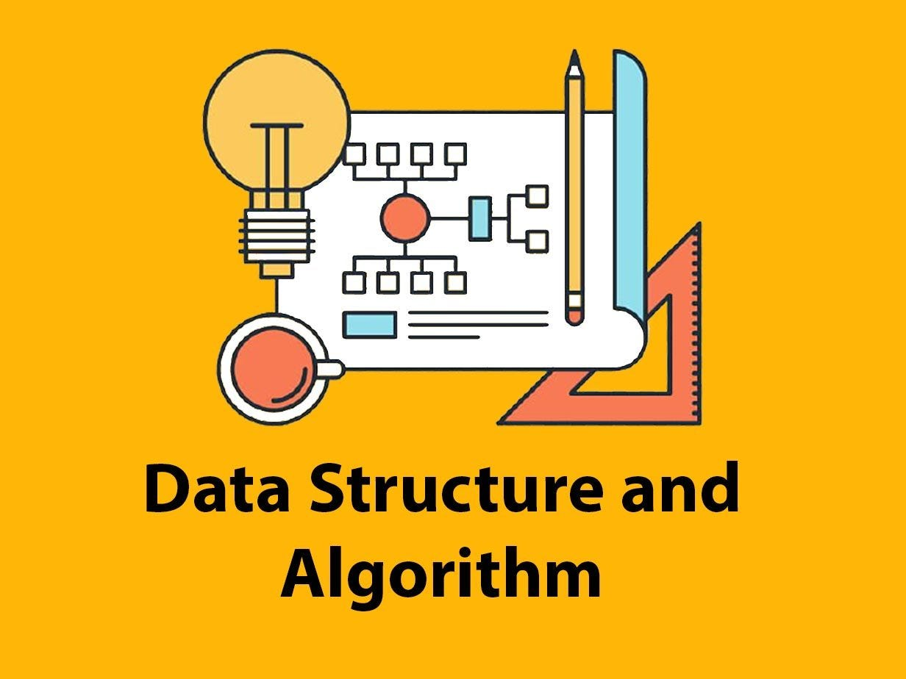

# Data Structures and Algorithms

Welcome to my **Data Structures and Algorithms** repository!

This repository contains my personal notes, lessons, and practice problems while learning DSA. Each topic includes beginner-friendly explanations, visual examples, time complexities, and coding exercises to help reinforce the concepts.

## Topics

- [Stack](./src/Stack/LESSON.md)
- [Queues](./src/Queues/LESSON.md)
- [LinkedList](./src/LinkedList/LESSON.md)
- [Dynamic Array](./src/DynamicArray/LESSON.md)

## What You'll Find

- Simple explanations
- Visual examples
- Time complexity analysis
- Practice problems
- Java implementations

---

  <b>Happy Coding!</b>

